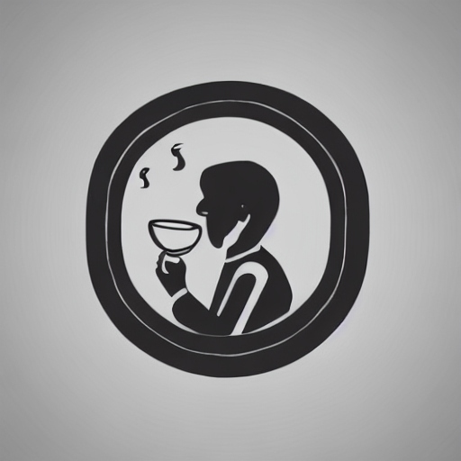

## Eye-Tea-Board

## Web Page
홈페이지 : [EyeTeaBoard](ec2-43-200-186-103.ap-northeast-2.compute.amazonaws.com)  
개발기간 : 2023.04.14 ~ 2023.05.16

### 프로젝트 소개
차를 마시며 IT를 주제로 이야기를 나누는 게시판 프로젝트입니다.

## Stacks
### 환경

### 개발
  

### CI / CD
   

### 서버

## 주요 기능
- ### 방문자
  - 게시글 읽기
  - 댓글 읽기

- ### 유저
|게시글 쓰기|게시글 수정|
|:---:|:---:|
|||

|게시글 좋아요|게시글 삭제|
|:---:|:---:|
||

|댓글 쓰기|댓글 삭제|
|:---:|:---:|
|||

|댓글 좋아요|
|:---:|
|||
  
  
- ### 관리자
|회원정보 열람&사용자 정지|게시글 삭제|
|:---:|:---:|
||||

|댓글 삭제|
|:---:|
|

- ### 공통
|카테고리별로 보기|좋아요순으로 정렬|
|:---:|:---:|
|||
